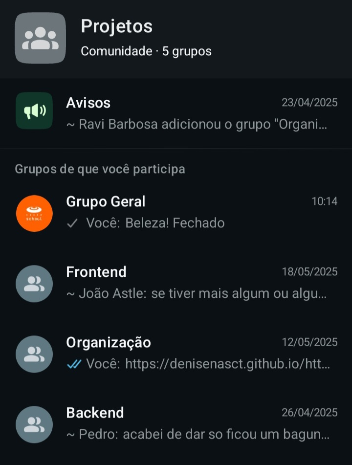

# InfoSaúde Recife

## Sobre o Projeto
A InfoSaúde Recife é uma plataforma digital que está sendo desenvolvida para facilitar o acesso a informações sobre os serviços de saúde pública. Nosso objetivo é otimizar a busca por atendimento, minimizando deslocamentos desnecessários, otmizando a distribuição da demanda nos postos de saúde e melhorando a experiência dos usuários.

A plataforma permitirá a consulta rápida e intuitiva das unidades de saúde disponíveis, oferecendo informações organizadas e acessíveis.

___

## Tecnologias Utilizadas

 
    
Clique para expandir

- 
- 
- 
- 
- 
- 
- 
- 

___

## Entrega 01

    
Clique para expandir

### Backlog

## Recursos do Projeto (Entrega 01)

- **Gerenciamento:**
    - [Trello](https://trello.com/b/DH96Xoq6/projeto-infosaude)

- **Apresentação:**
    - [Slides da Apresentação](https://www.canva.com/design/DAGCmpua3MQ/To3bhs9X5exntfk9QRJk5Q/edit?utm_content=DAGCmpua3MQ&utm_campaign=designshare&utm_medium=link2&utm_source=sharebutton)
- **Demonstração:**
    - [Screencast](https://drive.google.com/file/d/1X53gyZxotaYsbJRWsbnN4iZYeIEC44rE/view?usp=drive_link)
 
  ## Diagrama de Atividades

## Entrega 02

    
Clique para expandir

### 1. Visão Geral do Quadro (Trello)

### 2. Exemplo de User Story Detalhada

### 3. Progresso das Tarefas na Sprint

### 4. Organização de Responsáveis

___

# Instruções de Acesso ao InfoSaúde Recife

## Sobre o Projeto
O **InfoSaúde Recife** é uma plataforma digital desenvolvida para democratizar o acesso às informações de saúde pública da cidade de Recife.  
O projeto busca reduzir a peregrinação de cidadãos em busca de atendimento, organizando dados de forma clara e acessível, e promovendo a inclusão digital e a cidadania.

## Como Acessar
O acesso é gratuito e aberto ao público em geral.

 **Link da plataforma:**  
[https://denisenasct.github.io/https-github.com-infosauderecife/](https://denisenasct.github.io/https-github.com-infosauderecife/)

Não é necessário realizar cadastro ou autenticação.

---

## Navegação pela Plataforma

### Home
- Apresentação da proposta do InfoSaúde.
- Opções de busca de postos de saúde por **localização** ou por **especialidades médicas**.
- Acesso rápido às informações gerais, como horários de funcionamento e principais serviços oferecidos nos postos.

### Distritos
- Exibição de postos de saúde organizados por **distritos sanitários** de Recife.
- Visualização da distribuição dos postos em um **mapa interativo**, permitindo fácil identificação de unidades próximas.

### Menu de Serviços
- **Informações sobre Postos de Saúde:**  
  Endereços, serviços disponíveis e especialidades médicas oferecidas em cada unidade.
- **Orientações para o Cidadão:**  
  Documentação necessária para atendimento e instruções sobre como proceder em busca de serviços de saúde.
- **Contato e Suporte:**  
  Formulário protótipo para envio de dúvidas e sugestões (a ser implementado em versões futuras).

---

## Requisitos Técnicos
- **Navegadores Compatíveis:** Google Chrome, Microsoft Edge, Mozilla Firefox e Safari.
- **Dispositivos Compatíveis:** Computadores, smartphones e tablets (design responsivo).
- **Conexão:** Recomendável internet estável para melhor experiência de navegação.

---

## Observações
- A versão atual é um **protótipo estático**, desenvolvido para demonstrar a estrutura e o funcionamento da plataforma.
- Futuras versões do InfoSaúde irão incluir:
  - Integrações dinâmicas com bases de dados públicas.
  - Atualizações automáticas de informações dos postos de saúde.
  - Funcionalidades de comunicação direta com os usuários.

---

# Destaques do InfoSaúde

| Recurso                | Descrição                                                    |
|-------------------------|--------------------------------------------------------------|
| **Busca por Localização** | Encontre rapidamente postos próximos à sua residência.        |
| **Busca por Especialidade** | Consulte postos que oferecem serviços médicos específicos.    |
| **Mapa Interativo**      | Navegue visualmente pela cidade e identifique unidades de saúde. |
| **Inclusão Digital**     | Plataforma acessível a diferentes perfis de usuários.          |

___

## Recursos do Projeto (Entrega 02)

- **Gerenciamento:**
    - [Trello](https://trello.com/b/DH96Xoq6/projeto-infosaude)

- **Apresentação:**
    - [Slides da Apresentação](https://www.canva.com/design/DAGl8FnqY1g/FbNJSN2IKcpnlroenxiNYg/edit)

- **Demonstração:**
    - [Screencast](https://drive.google.com/file/d/18RZb0QfYtQ-2tBeta3jGFc_bRU2adzWu/view?usp=sharing)
___

## JUSTIFICATIVA DO NÃO USO DA PROGRAMAÇÃO EM PARES:
 
No contexto do Projeto InfoSaúde, optamos por não adotar a técnica de Programação em Pares devido à natureza multidisciplinar e acadêmica do time, bem como pela divisão prática de funções.
O foco principal do projeto esteve voltado para a construção de um protótipo funcional e um fluxo claro de navegação e informações, com ênfase em design de solução, pesquisa de usuário e estruturação de conteúdo — mais do que no desenvolvimento de software propriamente dito.
Como a maior parte das tarefas de desenvolvimento envolveu criação de artefatos simples (páginas HTML estáticas, linguagem back-end básica, documentação, estrutura de navegação) em vez de códigos complexos que exigissem lógica colaborativa intensa, a adoção de Programação em Pares não se justificaria em termos de ganho de produtividade ou qualidade técnica.
Além disso, o time priorizou a autonomia individual na execução de microentregas específicas (como a criação de fluxogramas, testes de usabilidade, e construção de telas) para garantir agilidade no cumprimento de prazos curtos e dinâmicos, típicos de projetos acadêmicos com datas de entrega fixas.
Caso o projeto evoluísse para uma fase de desenvolvimento mais robusta — por exemplo, com a integração de banco de dados, uma linguam back-end mais complexa e interfaces dinâmicas —, a prática de Programação em Pares seria considerada como uma estratégia para aumento de qualidade de código e redução de bugs.

Fatores e Justificativas:

Natureza do projeto	- Mais protótipo, menos software robusto;

Tipo de tarefas	- Simples, mais front-end básico e estrutura com back-end simples;

Organização da equipe - Divisão por microentregas para ser mais ágil;

Prioridade - Cumprir prazos de maneira leve e prática. Agilidade individual para cumprir prazos;

Visão Futura - Em projetos mais técnicos e sistemas mais complexos, a Programação em Pares poderá ser incorporada;

Back-end simples - Não exigiu codificação complexa que justificasse Programação em Pares.

## Issue/bug tracker atualizado

___
  
## Diagrama de Atividades

## Diagrama das Informações dos Distritos

## Diagrama do Mapa Interativo

## Entrega 03

    
Clique para expandir

## Recursos do Projeto (Entrega 03)

- **Gerenciamento:**
    - [Trello](https://trello.com/b/DH96Xoq6/projeto-infosaude)

   ## Visão do Trello Geral Atualizada com Novas Sprints e Histórias

    
    

   
  ## Visão do Trello Geral Para Próxima Sprint

   
   

---

## Diagramas Entrega 03: Diagrama da Seção de Dicas de Saúde

## Diagramas Entrega 03: Diagrama de Filtro por Posto de Saúde
    

## Entrega 04

    
Clique para expandir

## Recursos do Projeto (Entrega 04)

- **Gerenciamento:**
    - [Trello](https://trello.com/b/DH96Xoq6/projeto-infosaude)

- **Apresentação:**
    - [Slides da Apresentação](https://www.canva.com/design/DAGpOejQOt0/wK5Am8EomKBSgBj7YHpvpA/edit)
- **Demonstração:**
    - [Screencast](https://drive.google.com/drive/folders/1Mhz5oyf_5OxcyTGdNtxG_KQbgZTJOx58)
 

## Visão Geral do Quadro Trello Atualizada com Novas Sprints e Histórias

## Screencast com URL e Histórias Implementadas

[Screencast](https://drive.google.com/drive/folders/1Mhz5oyf_5OxcyTGdNtxG_KQbgZTJOx58)

## Issue/bug tracker atualizado : Geolocalização retorna posição incorreta (mar) ao clicar em “Posto mais próximo”

**Descrição:**
Ao clicar no botão “Posto mais próximo”, o mapa posiciona o marcador do usuário no meio do mar, em vez de usar sua localização real.

**Passos para reproduzir:**
1. Acesse o site: [https://denisenasct.github.io/https-github.com-infosauderecife/](https://denisenasct.github.io/https-github.com-infosauderecife/)
2. Clique no botão “Posto mais próximo”
3. Observe que o marcador aparece em uma posição inválida (ex: no oceano)

**Comportamento esperado:**
O sistema deve obter a localização correta do usuário (com permissão ativada) e centralizar o mapa no posto de saúde mais próximo.

**Comportamento atual:**
O marcador aparece no mar ou em coordenadas inválidas, mesmo com geolocalização ativa no navegador.

**Print do erro:**

**Ambiente de teste:**
- Navegador: Chrome 125  
- Sistema: Windows 10  
- Testado em: 02/06/2025  

**Sugestão de correção:**
Adicionar verificação de permissão de geolocalização, usar `try/catch` para tratar falhas, e oferecer uma alternativa manual caso a geolocalização automática falhe.

## Programação Em Pares

Organização do grupo por áreas de atuação (organização, geral, desenvolvimento, etc.)

Essa divisão estratégica no grupo do WhatsApp ajudou a facilitar a comunicação e garantir foco nas demandas específicas de cada frente do projeto. A partir disso, estruturamos também a programação em pares, incentivando a colaboração, o aprendizado mútuo e o acompanhamento mais próximo das tarefas. Trabalhar em duplas potencializou a qualidade das entregas e fortaleceu o senso de equipe.

## Diagrama Atualizado:
    

## Justificativa da Escolha da Ferramenta Trello

    
Clique para expandir

Para a gestão do projeto InfoSaúde Recife, optamos pelo uso do Trello como ferramenta principal de organização das atividades e acompanhamento das entregas. A decisão foi baseada nos seguintes fatores:

Facilidade de Uso e Acessibilidade: O Trello é uma plataforma intuitiva, que possibilita a colaboração remota da equipe de maneira simples e eficiente, atendendo às necessidades de times multidisciplinares e de projetos acadêmicos.

Metodologia Ágil (Scrum): O Trello permite a estruturação de quadros que simulam fluxos ágeis, como o Scrum, que foi a abordagem metodológica adotada pelo projeto. Os cartões representam tarefas (User Stories), os checklists indicam critérios de aceitação e os quadros são organizados em colunas que refletem o progresso das atividades (Backlog, To Do, Doing, Done).

Transparência e Rastreabilidade: A ferramenta proporciona visibilidade total sobre o andamento do projeto para todos os membros da equipe, facilitando a rastreabilidade das atividades realizadas e o gerenciamento do tempo de execução de cada etapa.

Integrações e Extensibilidade: A compatibilidade do Trello com outras ferramentas (como Google Drive e Slack) facilita a centralização de documentos, discussões e versões de artefatos desenvolvidos.

Custo-Benefício: Para o estágio atual do projeto, o Trello oferece uma versão gratuita que atende plenamente às necessidades, eliminando custos adicionais.

## Diagramas do Projeto

    
Clique para expandir

    
## Diagrama de Atividades

## Diagrama das Informações dos Distritos

## Diagrama do Mapa Interativo

## Diagrama da Seção de Dicas de Saúde

## Diagrama de Filtro por Posto de Saúde
    

## Diagrama Geral

___

## Nossa Equipe

- Ana Beatriz Astle
- Denise Tavares
- Eduardo de Medeiros Rocha
- Gustavo Magina
- João Victor Astle
- Maria Luiza Melo
- Pedro Gomes
- Ravi Barbosa
- Vinicius Cardoso
